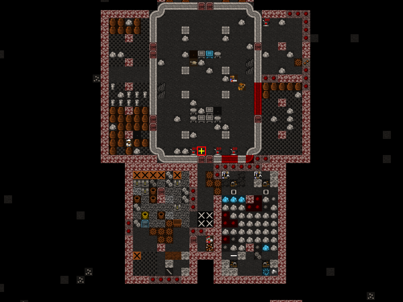

# DFMA HTML 5 Map Viewer

Home for development of a new HTML5 Map Viewer for Dwarf Fortress.

Please read the [architecture page](./docs/README.md) for details about how the viewer works; and how to set it up in a larger project.

## Local Developer Setup

Clone this repo, then run:

```
npm install
```

To start the parcel server, and view the map viewer, run:

```
npm start
open http://localhost:1234/index.html 
```

## Testing

When developing locally; please run:
```
npm run lint && npm test -s
```

These tests will be run on commit, and as part of PR testing.

There are also integration tests that can run locally - they use a headless browser and perform a pixel diff of the rendered map with known good state.

The tests can be run using:

```
npm run test:integration
```



## PR / Contribution Guidelines

We have a [project page](https://github.com/orgs/df-map-archive/projects/1) for site wide improvements that you may be able to help with, and a [forum post](http://www.bay12forums.com/smf/index.php?topic=176276.0) that you can follow to discuss ideas. Otherwise [raise an issue](/df-map-archive/dfma-html5-map-viewer/issues) on this repo and we'll get in touch.

Github actions are set up to run linting and tests against branches and PRs. You can and should run tests locally before submitting a PR.

When forking, or raising a PR please keep the PR in Draft until you're ready to merge, the project team will be notified in order to provide a code review before merging to master.

Please ensure that tests pass; and that you've added adequate testing around any new functionality introduced to the code base.

## Deployment Pipeline

The master branch is protected; the default action for merge to master is to build and deploy the viewer to the [/xdfmadev/parcel/](https://mkv25.net/dfma/xdfmadev/parcel/index.html) folder on the DFMA website.

## Creating a release

When you have a working tested, ready to release, version of the map viewer...

- [x] Update the version number in package.json using [`semver`](https://semver.org/)
- [x] Commit with the message `Prepare v{major}.{minor}.{patch} for release`
- [x] Go and draft a [new release](https://github.com/df-map-archive/dfma-html5-map-viewer/releases/new) with the tag in the syntax `v{major}.{minor}.{patch}`
- [x] Use the tag version as the title i.e. `v{major}.{minor}.{patch}`
- [x] Add a short and informative description about the release
- [x] Submit the `Publish release` button

This will trigger a deployment pipeline to upload the compiled files to:
- `https://mkv25.net/dfma/viewer/js/$RELEASE_VERSION`

## Credits

Credit where credit due:
- Thanks to [Jacob Blomquist](https://github.com/JacobRBlomquist) for his [original and continued work](https://github.com/JacobRBlomquist/DFMA-Viewer-HTML5) on the HTML version of the map viewer 
- [p5.js](https://p5js.org/) - for a fantastic canvas interface
- [pako](https://github.com/nodeca/pako) - for a fantastic zlib implementation
